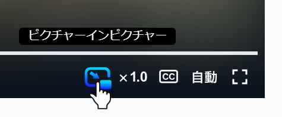

# ピクチャーインピクチャー for TVer



[TVer](https://tver.jp/)
でピクチャーインピクチャーを利用できるようにするブラウザ拡張機能です。

> [!WARNING]
> この拡張機能は、TVer公式とは一切関係ありません。\
> この拡張機能は、TVerの利用者に便利な機能を提供する非公式のツールであり、TVer公式の許可や承認を得たものではありません。また、TVerは株式会社TVerの商標です。

## インストール

<a href="https://chromewebstore.google.com/detail/%E3%83%94%E3%82%AF%E3%83%81%E3%83%A3%E3%83%BC%E3%82%A4%E3%83%B3%E3%83%94%E3%82%AF%E3%83%81%E3%83%A3%E3%83%BC-for-tver/iekdfbldkiobbodiohkcmjekclmippja">
   
</a>

## 開発

この拡張機能は、[Deno](https://deno.land/)を使用して開発されています。

### セットアップ

1. リポジトリをクローンします。

   ```sh
   git clone https://github.com/Hashory/picture-in-picture_for_tver.git
   ```

2. 開発に必要な型ファイルをキャッシュします。

   ```sh
   deno cache deno.json
   ```

3. 拡張機能のファイルを`/dist`に生成します。

   ```sh
   deno task bundle
   ```

4. コードの整形を行います。

   ```sh
   deno fmt
   ```

## ライセンス

[CC0-1.0 license](LICENSE)
